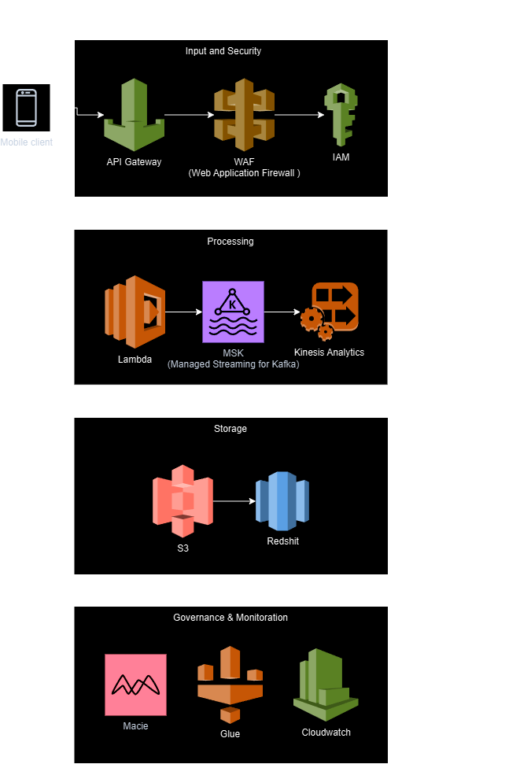

# ximple_pipe

**Ximple DE pipeline**

Solution for Data Engineering Challenge at Ximple

Part 1: Pipeline file `pipe.ipynb` has the steps to ingest, validate and process the data file.

Part 2: Diagram file from draw io for data architecture

